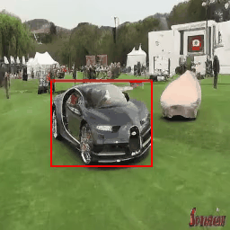

# Animate Your Motion: Turning Still Images into Dynamic Videos
This repo contains the official implementation for the paper Animate Your Motion: Turning Still Images into Dynamic Videos  

by [Mingxiao Li*](https://scholar.google.com/citations?user=0t2f7joAAAAJ&hl=en), [Bo Wan*](https://bobwan.w3spaces.com/), Marie-Francine Moens, and Tinne Tuytelaars

## Abstract

In recent years, diffusion models have made remarkable strides in text-to-video generation, sparking a quest for enhanced control over video outputs to more accurately reflect user intentions. Traditional efforts predominantly focus on employing either semantic cues, like images or depth maps, or motion-based conditions, like moving sketches or object bounding boxes. Semantic inputs offer a rich scene context but lack detailed motion specificity; conversely, motion inputs provide precise trajectory information but miss the broader semantic narrative. For the first time, we integrate both semantic and motion cues within a diffusion model for video generation, as demonstrated in Fig.1. To this end, we introduce the Scene and Motion Conditional Diffusion (SMCD), a novel methodology for managing multimodal inputs. It incorporates a recognized motion conditioning module and investigates various approaches to integrate scene conditions, promoting synergy between different modalities. For model training, we separate the conditions for the two modalities, introducing a two-stage training pipeline. Experimental results demonstrate that our design significantly enhances video quality, motion precision, and semantic coherence.

## Illustration of Our Method

## TODO
- [ ] Release inference code and pretrained weights
- [ ] Release training code
- [ ] Train the model on larger/better dataset

## Generated Videos

  
  
  

  
  
  

