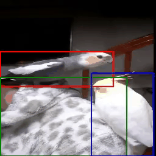

# [ECCV-24] Animate Your Motion: Turning Still Images into Dynamic Videos
This repo contains the official implementation for the ECCV paper [Animate Your Motion: Turning Still Images into Dynamic Videos](https://mingxiao-li.github.io/smcd/)  
by [Mingxiao Li*](https://scholar.google.com/citations?user=0t2f7joAAAAJ&hl=en), [Bo Wan*](https://bobwan.w3spaces.com/), Marie-Francine Moens, and Tinne Tuytelaars


## Abstract
<div stype="text-align: left;">
In recent years, diffusion models have made remarkable strides in text-to-video generation, sparking a quest for enhanced control over video outputs to more accurately reflect user intentions. Traditional efforts predominantly focus on employing either semantic cues, like images or depth maps, or motion-based conditions, like moving sketches or object bounding boxes. Semantic inputs offer a rich scene context but lack detailed motion specificity; conversely, motion inputs provide precise trajectory information but miss the broader semantic narrative. For the first time, we integrate both semantic and motion cues within a diffusion model for video generation, as demonstrated in Fig.1. To this end, we introduce the Scene and Motion Conditional Diffusion (SMCD), a novel methodology for managing multimodal inputs. It incorporates a recognized motion conditioning module and investigates various approaches to integrate scene conditions, promoting synergy between different modalities. For model training, we separate the conditions for the two modalities, introducing a two-stage training pipeline. Experimental results demonstrate that our design significantly enhances video quality, motion precision, and semantic coherence.

## Overview
<p align="center">
  
</p>

## Illustration of Our Method

Illustration of our proposed model: Designed for conditional video generation, our model can handle three control signals including images, bounding box sequences, and text. It builds on a pre-trained text-to-video framework, enriched with an object-gated self-attention layer, image-gated cross-attention layer, and a zero initialized input convolution layer. These enhancements allow it to adapt to bounding box and image conditions through a two-stage training process: first focusing on the object-gated self-attention, followed by the input convolution and image-gated cross-attention layers.

  
## TODO
- [x] Release inference code and pretrained weights
- [ ] Release training code
- [ ] Train the model on larger/better dataset


## Pretrained Weights
- [Model](https://huggingface.co/Lixiaoming/Animate-Your-Motion)  (batch size 16, 60000 steps)

## Generated Videos
<p align="center">
  
  
  
</p>
<p align="center">
  
  
  
</p>

<p align="center">
  
  
  
</p>

# Getting Started

## Installation
```
git clone https://github.com/Mingxiao-Li/Animate-Your-Motion   
cd Animate-Your-Motion   
conda env create -f environment.yaml
```

## Data Preparation
### Stage 1
In preparation
### Stage 2
We use Youvis and GOT-10K dataset to train our model.   
Please download both dataset from the official website. [YouTube-VIS2021](https://youtube-vos.org/dataset/vis/),
[GOT-10K](http://got-10k.aitestunion.com/)   
For youvis dataset, we use the caption generated in [TrackDiff](https://github.com/pixeli99/TrackDiffusion)

Dataset folder structure (All the generated data can be downloaded via this [Link](https://huggingface.co/Lixiaoming/Animate-Your-Motion/tree/main) )
```
├── dataset
│   ├── youvis
│   │   │── caption.json (generated text caption)
│   │   │── train
│   │   │   │── JPEGImages
│   │   │   │── instances.json (the official annotation files)
│   │   │   │── annotations_info.json (our generated files)
│   │   │   │── annotations_info_with_cat_emb.json (our generated files)
│   │   │   │── ......
│   │   │── valid
│   │   │   │── JPEGImages
│   │   │   │── instances.json (the official annotation files)
│   │   │   │── ......
│   │   │── test
│   │   │   │── JPEGImages
│   │   │   │── instances.json (the official annotation files)
│   │   │   │── ......
│   │   │── annotations (the converted annotation file)
|   |── got10k
|   |   |── got10k_val_caption.json
|   |   |── obj_embedding.json
|   |   |── train
|   |   |   |── GOT-10k_Train_00001 (contains all image in this video)
|   |   |   |── ......
|   |   |── val
|   |   |   |── GOT-10k_Val_00001 (contains all image in this video)
|   |   |   |── ......
|   |   |── test
|   |   |   |── GOT-10k_Test_00001 (contains all image in this video)
|   |   |   |── ......
```
## Training model
### Stage 1
```
In preparation 
```
### Stage 2
```
accelerate launch  ms_main.py \
--config "./configs/object_tracking_ms_stage2.yaml" \
--train_batch_size 4 \
--output_dir  path to save ckpt\
--gradient_accumulation_steps 4 \
--train_grounding vanilla_cross_vision \
--use_img_free_guidance  \
--cross_vision \
--cat_init \
--tune_from_ckpt_path  model to tune from \
```


## Running evaluation on got10k/youvis
```
accelerate launch inference_eval.py \
--config ./configs/object_tracking_eval.yaml \
--video_length 8 \
--train_grounding vanilla_cross_vision \
--trained_ckpt_path # path of pretrained weights \
--cross_vision \
--dataset #dataset (eg youvis, got10k) \
--output_dir # path to save results \
--batch_size 1 \
--cat_init \
```

## Running inference with customized image and box sequence
```
accelerate launch inference_customize.py \
--config ./configs/customize_infer.yaml \
--video_length 8 \
--train_grounding vanilla_cross_vision \
--trained_ckpt_path # path of pretrained weights \
--cross_vision \
--output_dir # path to save your result \
--cat_init \
--prompt # prompt \
--input_data_path # folder contains your image and box sequence (.txt)
```

## Citation
If you find our work useful, please feel free to cite by
```
@article{li2024animate,
  title={Animate Your Motion: Turning Still Images into Dynamic Videos},
  author={Li, Mingxiao and Wan, Bo and Moens, Marie-Francine and Tuytelaars, Tinne},
  journal={European Conference on Computer Vision },
  year={2024}
}


